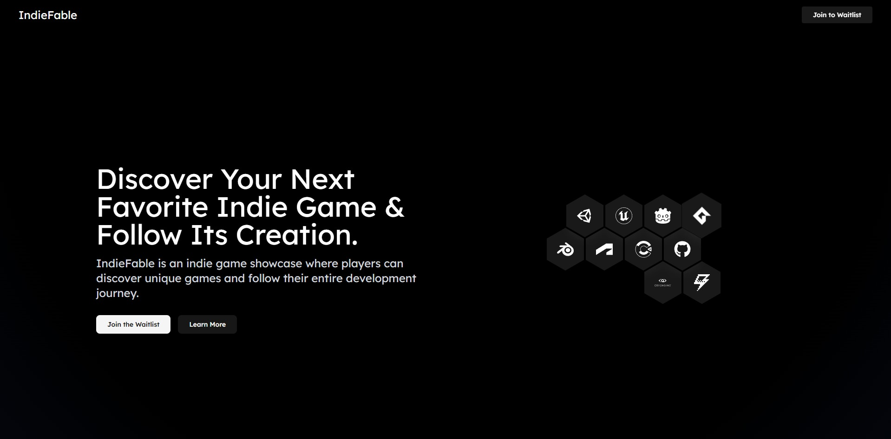

# IndieFable

[](https://github.com/emrhn-gngr/IndieFable)
[](https://opensource.org/licenses/MIT)

**An indie game showcase powered by the stories of their creators.**

IndieFable is a platform where players can discover unique indie games and follow their entire development journey from concept to launch.



---

## 💡 The Problem

Independent game developers create incredible games, but often struggle with marketing and visibility. Their development journey—the bugs, the breakthroughs, the art—is a compelling story that gets lost across scattered social media posts or buried deep inside store pages. Players who want to connect with the "making-of" process have no central place to do so.

## ✨ The Solution: IndieFable

IndieFable tackles this problem by providing a dual-purpose platform:

* **For Players:** A beautiful, visual-first showcase to discover new and upcoming indie games. It's a catalog of creativity where you can find your next favorite game.
* **For Developers:** A free and powerful tool to build a community *while* you build your game. By sharing your development story through devlogs, you turn your process into your best marketing tool, building hype and connecting with players long before launch.

## 🚀 Core Features

* **🎮 Indie Game Showcase:** A player-focused homepage featuring a grid of indie games, designed for easy discovery.
* **📖 Project Pages:** Every game gets a dedicated page featuring its trailer, screenshots, description, and purchase/wishlist links.
* **📜 Devlog Journey:** Right below the main showcase info on each game page, players can scroll through the entire development history—from concept art to the latest updates.
* **✍️ Easy Devlog Publishing:** A simple, Markdown-supported editor for developers to post updates with rich text and images.
* **🔒 Secure Authentication:** Easy and secure sign-up/login for developers using Google or GitHub.

## 🛠️ Tech Stack

This project is built with a modern, scalable, and serverless-first technology stack.

| Category      | Technology                                                                                                                                                                                                                       |
| ------------- | -------------------------------------------------------------------------------------------------------------------------------------------------------------------------------------------------------------------------------- |
| **Frontend** |              |
| **Backend** |                                                                         |
| **Database** |                                                                                                                                                                |
| **Auth** |                                                                                                                                                         |
| **Storage** |                                                                                                                                                      |
| **Deployment**|                                                                                                                                                                   |
| **Design** |                                                                                                                                                                     |

## ⚙️ Getting Started

To run this project locally, follow these steps:

1.  **Clone the repository:**
    ```bash
    git clone [https://github.com/](https://github.com/)/IndieFable.git
    cd IndieFable
    ```

2.  **Install dependencies:**
    ```bash
    npm install
    # or
    yarn install
    ```

3.  **Set up environment variables:**
    Create a `.env.local` file in the root of the project and add the following variables. You can get these from their respective platforms.
    ```env
    # MongoDB Connection String
    MONGODB_URI=

    # NextAuth.js
    NEXTAUTH_URL=http://localhost:3000
    NEXTAUTH_SECRET= # Generate a secret: `openssl rand -hex 32`

    # Google OAuth Credentials
    GOOGLE_CLIENT_ID=
    GOOGLE_CLIENT_SECRET=

    # GitHub OAuth Credentials
    GITHUB_CLIENT_ID=
    GITHUB_CLIENT_SECRET=

    # Cloudinary Credentials
    CLOUDINARY_CLOUD_NAME=
    CLOUDINARY_API_KEY=
    CLOUDINARY_API_SECRET=
    ```

4.  **Run the development server:**
    ```bash
    npm run dev
    ```
    Open [http://localhost:3000](http://localhost:3000) in your browser to see the result.

## 🗺️ Project Roadmap (The Journey Ahead)

This is just the beginning. IndieFable aims to grow with the community.

* **🚀 Phase 1: Launch (Building Now)**
    * Visual Indie Game Showcase
    * Project Pages & Cover Art
    * Rich Devlog Publishing

* **❤️ Phase 2: Community (Next Up)**
    * Comments, Likes & Upvotes
    * Following Creators & Projects
    * Community Moderation Tools

* **🧭 Phase 3: Discovery (Planned)**
    * Personalized Timeline Feeds
    * Advanced Search & Filtering by Genre/Tag
    * Trending Projects & Devlogs

## 👨‍💻 Author

Hi, I'm **Emirhan**, a recent Computer Engineering graduate. I love building beautiful and functional web applications. This project is a demonstration of my full-stack development skills.

* **GitHub:** [@emrhngnr](https://github.com/emrhngngr)
* **LinkedIn:** [@emrhn-gngr](https://www.linkedin.com/in/emrhn-gngr)
* **Twitter:** [@justEmrhn](https://x.com/justEmrhn)

## 📜 License

This project is licensed under the MIT License. See the [LICENSE](LICENSE) file for details.
